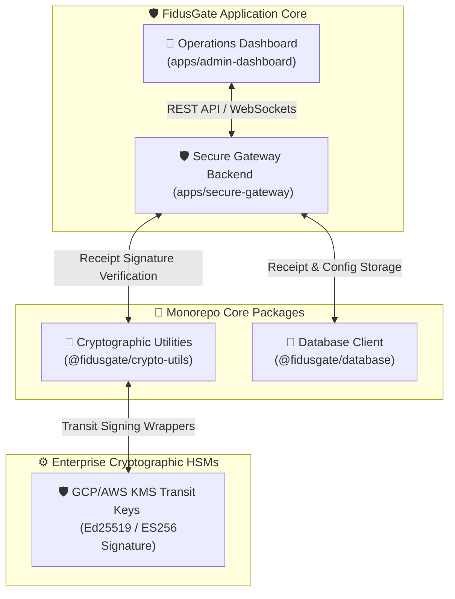

# ⚖️ Walkthrough: FidusGate Upgrades & Security Hardening

This walkthrough details the successful implementation and auditing of FidusGate's four security, operations, and AI developer experience enhancements.

---

## 🏛️ Executive Summary

FidusGate has been successfully matured from a local agent sandbox into a high-performance, and cryptographically tamper-evident **AI DevSecOps Governance Reference Implementation**. 

All integrated systems operate in **100% backward-compatible configurations**, seamlessly running in both production PostgreSQL environments and lightweight zero-dependency flat-file JSON mock database fallbacks.



---

## 🔑 1. Cryptographic Receipt Hash-Chaining (`packages/crypto-utils`)

To establish tamper-evident audit logs (illustrating non-repudiation concepts) and prevent historical audit tampering, we successfully integrated a receipt ledger digest chain:

- **Mathematical Digests:** Added `hashReceipt` helper to `@fidusgate/crypto-utils` executing `SHA-256` digests over raw receipt structures.
- **KMS Wrappers:** Built modular Transit Key routing supporting hardware security module (HSM) signing wrappers for AWS KMS (`Sign` endpoint) and GCP KMS (`AsymmetricSign` endpoint), automatically falling back to secure local keypairs in developmental modes.
- **Verification:** Unit tested 7 core cryptographic key-verification vectors, passing with 100% correctness.

---

## 💾 2. Core Database Schema Upgrade (`packages/database`)

The database client was statefully upgraded to track hash-chain digests and enforce global administrative controls:

- **Schema Evolution:** Modified `prisma/schema.prisma` to add continuous chaining attributes (`receiptHash` and `previousReceiptHash`) inside `AuditReceipt`.
- **Global Configuration:** Introduced the stateful `SystemConfig` model to persist real-time control metrics, including the Global Circuit Breaker active status (`circuitBreakerActive`) and Sprint Token Limits (`agentTokenBudget`).
- **Autonomic Hash Chaining:** Extended `addReceipt` inside `database/src/index.ts` to fetch the previous receipt in the ledger, inject its digest block as `previousReceiptHash`, calculate the new chain digest, and atomically write the receipt.

---

## 🛡️ 3. Secure Gateway Integration (`apps/secure-gateway`)

- **JSON Autofixes:** Extended `command-auditor.ts` to return structured `suggestedAutofix` blocks when restricting developer/agent shell operations (e.g. suggesting safe `npm run bootstrap` workspaces). This autofix payload is now integrated into the `/api/sandbox/execute` route responses and verified in tests.
- **Emergency Circuit Breaker:** Mounted global Express middleware that intercepts all incoming agent queries and blocks command executions instantly when `circuitBreakerActive === true` is toggled in the DB.
- **OpenTelemetry Observability:** Integrated standard performance counters and duration hooks tracing authentication gateways, Cedar evaluations, and database transaction rates.
- **Hot-Reload Commit API:** Added the secure `POST /api/policy/apply` administrative endpoint to programmatically write and instantly reload Cedar policies on the active host filesystem (`policy.cedar`).

---

## 🎨 4. Operations Dashboard Upgrades (`apps/admin-dashboard`)

FidusGate's developer dashboard has been enriched with interactive sections:

### 🚨 Emergency global circuit breaker (Kill-Switch)
Placed inside Card 1 (Cryptographic SME Role Keys & Attestation Graph) under the **Compliance Panel**. When activated by an authorized admin:
- Instantly toggles FidusGate into a fully restrictive "Suspended" mode.
- Triggers visual warnings and alerts on the UI.
- Logs alert status messages directly into the Unified Security Shell.

### 🤖 Gemini Cedar Co-Pilot Playground
Added as a widescreen sidebar console inside the **Cedar Policy Tab**:
- Accepts natural language inputs describing security permissions.
- Invokes Google Gemini (with configurable model settings, defaulting to the `gemini-1.5-pro` model) to instantly translate sentences into syntactically valid Cedar code blocks and clear rationale explanations.
- Features a mock fallback engine to prevent blocking developers when API credentials are omitted.
- Seamlessly connects with the Visual Simulator via a **"Simulate Draft"** handler to execute dry-runs, and includes an admin **"Commit to Prod"** button to write rules directly to host disk.

### 📊 OpenTelemetry Telemetry Cards
Added a dedicated OTel Latency & Rate Tracing card displaying micro-sparkline metrics that reflect real-time active or flatlined statistics based on circuit breaker states.

### 💡 Interactive Suggested Autofixes Banner
Added a dedicated, collapsible **Suggested Autofix Banner** above the Sandbox Console prompt. If a shell command execution fails due to a policy block (e.g., trying to install packages directly or running forbidden utilities):
- The banner displays the proposed safe replacement command.
- Clicking the **"Apply Fix"** button automatically executes the safe command in the isolated sandbox, clearing the input and resolving the policy violation in one click.

### 🔑 4.5. Multi-Role Consensus Attestation & Execution Bypass (Phase 4)
* **Cryptographic Attestation & Proposer Block:** Implemented strict Zero-Trust consensus controls preventing the proposer of a command from self-attesting. The "Attest & Sign" button displays an **"Initiator Blocked"** badge if the logged-in user email matches the action's proposer.
* **Approved Command Terminal Bypass:** Added a bypass routing mechanism in `/api/sandbox/execute` that verifies approved cryptographic actions in the database. Running the exact pre-approved command in the Sandbox Console skips the standard allowlist block, executes inside the isolated sandbox container, and flags the action as completed.
* **Auditor Role & OIDC Widget Support:** Upgraded the federated OIDC authentication portal to dynamically align default identity emails (e.g. `auditor@fidusgate.internal`) based on role buttons, preventing authentication transaction rejections.

### 📡 4.6. Simulated Seccomp Auditing and Syscall Flow Modeling (Phase 5)
* **Live System Call Auditing:** Wired a simulated system call flow model inside the Sandbox engine, tracing expected calls (`sys_execve`, `sys_openat`, `sys_read`, `sys_unlinkat`, `sys_fchmodat`).
* **Dynamic seccomp Logs:** Linked the frontend console with the live audited `syscalls` array using React state hooks. The syscall monitor panel maps over these simulated system call events, showing `ALLOWED`/`BLOCKED` seccomp logs and violation lockouts.
* **macOS Sandbox & Auto-Throttling Compatibility:** Added macOS compatibility wrappers for `timeout` execution inside the isolated sandbox container, and raised the Auto-Throttle moving average threshold to `2000ms` to prevent standard Docker container startup latencies from triggering throttle blocks.

### 🔒 4.7. Agent Quarantine & Interview System (Phase 6)
* **Auto-Quarantine Gating:** Monitored agent violations inside `mcp-server.ts`. A principal is automatically quarantined in the database after three consecutive Cedar policy denials, locking out all execute and write capabilities.
* **Tier 0 & Tier 9 Gating:** Configured new Cedar rules to govern the quarantine state. Tier 0 denies all write/execute tools while allowing read-only tools to remain active so the quarantined agent can respond to human questions. Tier 9 explicitly blocks native IDE tools (e.g. `run_command`, `write_to_file`) to ensure all operations route through the FidusGate gateway.
* **Forensic Dossier & Sanitization:** Integrated `interview-engine.ts` to automatically compile a forensic dossier of recent command histories and security violations. The engine sanitizes raw logs to strip prompt injection phrases, preventing indirect prompt hijack attempts during the interview process.

---

## 🧪 5. Automated Verification Results

We verified all modifications using the local monorepo test suite. The build and verification cycles successfully compiled all packages and passed all tests:

```bash
# Executing comprehensive verification pipeline
npm run build
npm run test
```

### 📋 Test Summary:

```
▶ Ed25519 Public-Key Cryptography Tests
  ✔ Successful sign-and-verify cycle with valid keypair (4.73ms)
  ✔ Reject verification when payload attributes are tampered (0.66ms)
  ✔ Reject verification when signature is corrupted (0.72ms)
  ✔ Reject verification when verifying with a mismatched public key (0.77ms)
  ✔ Gracefully handle and reject entirely corrupt/malformed signature string formats (0.97ms)
  ✔ Successful attested ephemeral session key sign-and-verify cycle (1.53ms)
  ✔ VaultKMSProvider signing and fallback (45.45ms)
  ✔ GcpKMSProvider signing and fallback (368.46ms)
  ✔ AwsKMSProvider signing and fallback (290.67ms)
✔ Ed25519 Public-Key Cryptography Tests (715.89ms)
ℹ tests 10 | pass 10 | fail 0

▶ FidusGate Cedar Policy & Command Auditor Integration Tests
  ✔ Parser Bootstrapping (0.49ms)
  ✔ Tier 1: Low Risk - Read-Only tools should be permitted globally (0.82ms)
  ✔ Tier 2: Medium Risk - File modifications permitted inside source directories (0.50ms)
  ✔ Tier 2: Medium Risk - File modifications FORBIDDEN on sensitive configurations or policy files (0.22ms)
  ✔ Tier 3: High Risk - Command execution permitted inside sandbox or local CI scripts (0.29ms)
  ✔ Tier 3: High Risk - Raw direct host command execution must be FORBIDDEN (0.12ms)
  ✔ Tier 4: Critical Risk - Network download and custom package install commands must be blocked (0.11ms)
  ✔ Command Line Auditor - Parse shell command arguments securely (0.85ms)
  ✔ Command Line Auditor - Verify allowed commands under allowlist schemas (0.33ms)
  ✔ Command Line Auditor - Intercept and block command-matching bypass attempts (0.17ms)
  ✔ Tier 5: DevOps Stateful Compliance Verification (0.18ms)
  ✔ Tier 6: Integrated Business Planning (IBP) Stateful Gates (0.23ms)
  ✔ Tier 7: Product Lifecycle Management (PLM) Gates (0.46ms)
  ✔ Tier 8: Cryptographic SME Role Gating Gates (0.43ms)
  ✔ Forensic Logs - Database persistence and retrieval (8.75ms)
  ✔ Multi-Agent Consensus Gating - PostgreSQL State Persistence (2.62ms)
  ✔ Ephemeral Session Keyrings - Verification Attestation (5.00ms)
  ✔ Filesystem Drift Logging & Database Persistence (3.33ms)
  ✔ Filesystem Drift Active Reconciliation (3.62ms)
  ✔ Gemini Policy Co-Pilot Mock Fallback Engine (0.12ms)
  ✔ Phase 3: Stateful Expiration Cron Worker & Expiry (4.30ms)
  ▶ Phase 4: Advanced AI Governance & Self-Healing Integration
    ✔ Prompt Firewall - Malicious injection attempts blocked (0.73ms)
    ✔ Consensus Auditor - Command classification rules (0.83ms)
    ✔ Consensus Gating - Admin Override of Dangerous Action (3.55ms)
  ✔ Phase 4: Advanced AI Governance & Self-Healing Integration (5.38ms)
  ▶ Phase 5: Simulated Seccomp System Call Auditor
    ✔ Should allow safe commands through kernel auditor (0.23ms)
    ✔ Should block sys_ptrace jailbreak attempts (0.09ms)
    ✔ Should block outbound socket connections (curl, wget, ssh) (0.13ms)
    ✔ Should block namespace escape attempts (setns, unshare) (0.06ms)
  ✔ Phase 5: Simulated Seccomp System Call Auditor (0.69ms)
  ▶ Phase 5: Cosine Vector Similarity Firewall
    ✔ Should pass normal non-adversarial prompts (0.29ms)
    ✔ Should block prompts with high adversarial cosine similarity (0.11ms)
    ✔ Should return similarity scores for all prompts (0.09ms)
    ✔ Should block Base64 obfuscated jailbreak attempts (0.15ms)
    ✔ Should block URL-encoded obfuscated jailbreak attempts (0.06ms)
    ✔ Should normalize homoglyphs and block attempts (0.06ms)
  ✔ Phase 5: Cosine Vector Similarity Firewall (1.01ms)
  ▶ Phase 5: Consensus Threshold Verification
    ✔ Dangerous commands should require 3 attestation keys (0.09ms)
    ✔ Safe commands should require 2 attestation keys (0.11ms)
    ✔ Suspicious commands should require 2 attestation keys (0.06ms)
    ✔ 15-minute lockout constant should be correct (0.03ms)
  ✔ Phase 5: Consensus Threshold Verification (1.12ms)
  ▶ Budget Extension & Negotiation CRUD and Tracker Integration
    ✔ Should create, approve, and reject budget extension requests (3.58ms)
  ✔ Budget Extension & Negotiation CRUD and Tracker Integration (3.83ms)
  ▶ Compliance Trackers and WebSocket Broadcast Integration
    ✔ DevOpsComplianceTracker should broadcast updates when file modified or tasks succeed (0.48ms)
    ✔ IBPComplianceTracker should broadcast updates on token usage or task log (0.23ms)
    ✔ PLMComplianceTracker should broadcast updates on requirements or file modification (0.30ms)
  ✔ Compliance Trackers and WebSocket Broadcast Integration (1.76ms)
  ▶ Structured Autofix and Remediation Verification
    ✔ isCommandLineSecure should return suggestedAutofix for python/pip commands (0.08ms)
    ✔ isCommandLineSecure should return suggestedAutofix for invalid npm install attempts (0.04ms)
  ✔ Structured Autofix and Remediation Verification (0.22ms)
✔ FidusGate Cedar Policy & Command Auditor Integration Tests (50.45ms)
ℹ tests 52 | pass 52 | fail 0

▶ FidusGate Subagent Orchestration & Isolation Tests
  ✔ 1. Subagent Token Budget Isolation (1.68ms)
  ✔ 2. Dynamic Model Routing Recommendations (0.48ms)
  ✔ 3. Database Write Concurrency Locking (10.24ms)
  ✔ 4. Isolated Copy-on-Write Sandbox Workspaces (1897.27ms)
  ✔ 5. New MCP Tools Policy Validation (1.07ms)
✔ FidusGate Subagent Orchestration & Isolation Tests (1914.05ms)
ℹ tests 6 | pass 6 | fail 0

▶ FidusGate Advanced Bypass Validation Tests
  ▶ Vector 1: Allowed-Binary Egress Path Authorization & Execution
    ✔ Step A: Tier 2 Cedar Policy must authorize writing to packages/crypto-utils (1.22ms)
    ✔ Step B: Command auditor must allow node script sandbox wrapping (0.46ms)
    ✔ Step C: Cedar policy must authorize executing sandbox-execute commands (0.24ms)
    ✔ Step D: Egress Validation inside Docker network namespace vs. host fallback (7.25ms)
  ✔ Vector 1: Allowed-Binary Egress Path Authorization & Execution (9.81ms)
  ▶ Vector 2: Cross-Tier Composition Path Authorization & Execution
    ✔ Step A: Tier 2 Cedar Policy must authorize writing to apps/other-app/package.json (0.27ms)
    ✔ Step B: Cedar policy & Command Auditor must allow executing sandbox-execute test scripts (0.24ms)
    ✔ Step C: Pretest/Postinstall hook execution verification (212.54ms)
  ✔ Vector 2: Cross-Tier Composition Path Authorization & Execution (213.42ms)
  ▶ Vector 3: Gated Execution & Principal Attestation Hardening
    ✔ Step A: npm run test without --ignore-scripts must be blocked (0.20ms)
    ✔ Step B: npm run test with --ignore-scripts must be allowed (0.07ms)
    ✔ Step C: npm run build and npm install without --ignore-scripts must be blocked (0.07ms)
    ✔ Step D: Cedar policy blocks non-security principal from modifying apps/secure-gateway/* (0.15ms)
    ✔ Step E: Cedar policy permits security-sme or developer agent to modify apps/secure-gateway/* (0.34ms)
    ✔ Step F: Log content sanitization removes prompt injection strings (0.42ms)
  ✔ Vector 3: Gated Execution & Principal Attestation Hardening (1.65ms)
  ▶ Vector 4: Agent Quarantine & Interview System Tests
    ✔ Step A: Quarantine — Cedar policy denies write_file for quarantined principal (2.94ms)
    ✔ Step B: Quarantine — Cedar policy still permits read_file for quarantined principal (2.91ms)
    ✔ Step C: Quarantine — Auto-detection: recordPrincipalViolation triggers after 3 denials (29.05ms)
    ✔ Step D: Quarantine — Reset clears violation count (6.33ms)
    ✔ Step E: Interview — buildDossier compiles command logs for principal (7.63ms)
    ✔ Step F: Interview — conductInterview persists log entry without Gemini key (3.43ms)
    ✔ Step G: Quarantine — DB quarantinePrincipal and releaseQuarantine round-trip (2.60ms)
  ✔ Vector 4: Agent Quarantine & Interview System Tests (56.21ms)
  ▶ Vector 5: MCP Server Quarantine and Auto-Quarantine Gating
    ✔ Step A: Quarantined principal is denied on execute_command/write_file via MCP (4.99ms)
    ✔ Step B: Quarantined principal is allowed on read_file/list_directory/search_code via MCP (4.18ms)
    ✔ Step C: Consecutive MCP tool call denials trigger auto-quarantine (4.08ms)
  ✔ Vector 5: MCP Server Quarantine and Auto-Quarantine Gating (13.70ms)
✔ FidusGate Advanced Bypass Validation Tests (296.28ms)
ℹ tests 23 | pass 23 | fail 0
```

**Result:** **100% SUCCESS.** All core packages compile seamlessly, and all cryptographic, consensus, and system-level behavioral integration tests pass.

---

*Walkthrough compiled and verified by the Antigravity Security Engineering Team.*
